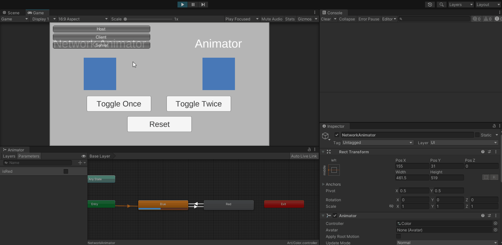

# Issue
`NetworkAnimator` does not keep track of parameter value changes correctly if it changes too fast

# Steps to reproduce

1. Start as host
2. Click `Toggle Twice`
3. Notice that resulting color from both squares are different
4. Notice that the last value `isRed` logged is `false` but the animator parameter is `true` on the inspector for `NetworkAnimator Square`

The difference between both squares is the usage of `NetworkAnimator` component
